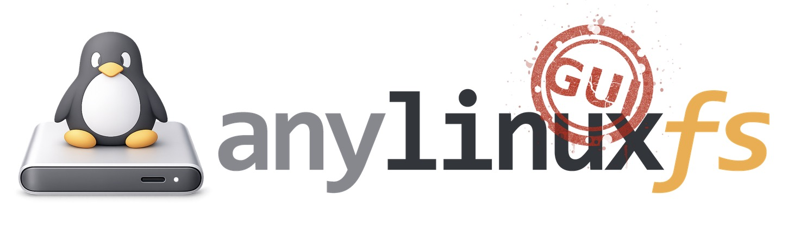

<p align="center">
  
</p>

A macOS GUI application for [anylinuxfs](https://github.com/nohajc/anylinuxfs) - mount Linux filesystems (ext4, btrfs, XFS, etc.) on macOS.

## Features

- **Disk Management** - Browse and mount Linux partitions (ext2/3/4, btrfs, XFS, ZFS, etc.)
- **Safe Eject** - Properly unmount and eject external drives with one click
- **Encrypted Drives** - Support for LUKS and BitLocker encrypted volumes
- **Embedded VM Shell** - Interactive terminal with image selector (Alpine Linux or FreeBSD)
- **Custom Actions** - Create and manage mount/unmount hooks with environment variables
- **Image Management** - Install/uninstall VM images (Alpine Linux, FreeBSD for ZFS)
- **Package Management** - Add/remove custom Alpine packages to extend VM capabilities
- **Real-time Monitoring** - Live mount status and log viewer with follow mode
- **VM Configuration** - Customize RAM, vCPUs, and log verbosity
- **Auto-refresh** - Disk list updates automatically when drives are connected/ejected
- **Native macOS** - Light/dark mode support, Apple Silicon optimized

## Screenshots


## Requirements

- macOS (Apple Silicon)
- [anylinuxfs CLI](https://github.com/nohajc/anylinuxfs) installed via Homebrew:
  ```
  brew install nohajc/anylinuxfs/anylinuxfs
  ```

## Installation

### Homebrew (recommended)

```bash
brew install fenio/tap/anylinuxfs-gui
```

If you get "damaged" or Gatekeeper warnings, run:
```bash
xattr -cr /Applications/anylinuxfs-gui.app
```

### Manual

Download the latest DMG from [Releases](../../releases), open it, and drag the app to Applications.

**Important:** The app is not notarized by Apple. After installation, remove the quarantine attribute:

```bash
xattr -cr /Applications/anylinuxfs-gui.app
```

Then you can open the app normally.

## Building from Source

### Prerequisites

- [Node.js](https://nodejs.org/) (v18+)
- [Rust](https://rustup.rs/)
- [Tauri CLI](https://tauri.app/)

### Build

```bash
npm install
npm run tauri build
```

The built app will be at `src-tauri/target/release/bundle/macos/anylinuxfs-gui.app`

## License

GPL-3.0 - see [LICENSE](LICENSE)
