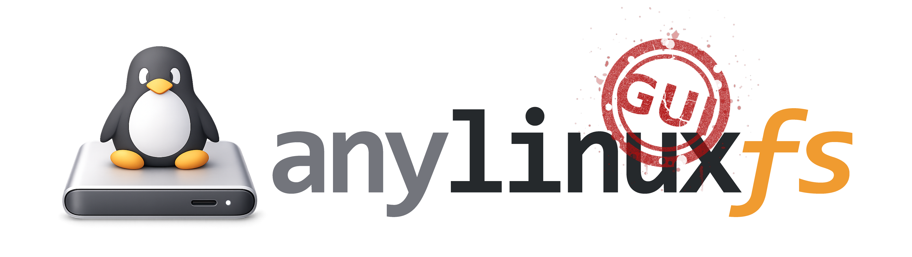

<p align="center">
  
</p>

A macOS GUI application for [anylinuxfs](https://github.com/nohajc/anylinuxfs) - mount Linux filesystems (ext4, btrfs, XFS, etc.) on macOS.

## Features

- **Disk Management** - Browse and mount Linux partitions (ext2/3/4, btrfs, XFS, ZFS, etc.)
- **Safe Eject** - Properly unmount and eject external drives with one click
- **Encrypted Drives** - Support for LUKS and BitLocker encrypted volumes
- **Embedded VM Shell** - Interactive terminal with image selector (Alpine Linux or FreeBSD)
- **Custom Actions** - Create and manage mount/unmount hooks with environment variables
- **Image Management** - Install/uninstall VM images (Alpine Linux, FreeBSD for ZFS)
- **Package Management** - Add/remove custom Alpine packages to extend VM capabilities
- **Real-time Monitoring** - Live mount status and log viewer with follow mode
- **VM Configuration** - Customize RAM, vCPUs, and log verbosity
- **Auto-refresh** - Disk list updates automatically when drives are connected/ejected
- **Native macOS** - Light/dark mode support, Apple Silicon optimized

## Screenshots

<picture>
  <source media="(prefers-color-scheme: dark)" srcset="https://github.com/user-attachments/assets/f8457756-b829-4ed6-b2fc-a11d57218444" />
  <source media="(prefers-color-scheme: light)" srcset="https://github.com/user-attachments/assets/9f2659cc-9bbb-481a-b1aa-9919fecda7a1" />
  
</picture>

<picture>
  <source media="(prefers-color-scheme: dark)" srcset="https://github.com/user-attachments/assets/04f3c527-9c1f-4d15-8808-dc949972b085" />
  <source media="(prefers-color-scheme: light)" srcset="https://github.com/user-attachments/assets/53085129-b895-412d-8ed8-2bd70f23671d" />
  
</picture>

<picture>
  <source media="(prefers-color-scheme: dark)" srcset="https://github.com/user-attachments/assets/713c142b-3e19-4c17-b3de-c124e60c6ea3" />
  <source media="(prefers-color-scheme: light)" srcset="https://github.com/user-attachments/assets/938f800b-c537-4021-96de-c08c1bbaff16" />
  
</picture>

<picture>
  <source media="(prefers-color-scheme: dark)" srcset="https://github.com/user-attachments/assets/9e3d1839-fc8e-405e-8799-2049bb882bc5" />
  <source media="(prefers-color-scheme: light)" srcset="https://github.com/user-attachments/assets/cbff7630-9e00-4ffc-ae42-9986824a58b1" />
  
</picture>

<picture>
  <source media="(prefers-color-scheme: dark)" srcset="https://github.com/user-attachments/assets/2a224724-b53d-4f2f-964c-c834197d7adc" />
  <source media="(prefers-color-scheme: light)" srcset="https://github.com/user-attachments/assets/825d9319-82d7-4568-9af6-48f1a421251c" />
  
</picture>

<picture>
  <source media="(prefers-color-scheme: dark)" srcset="https://github.com/user-attachments/assets/9a3ea976-f2e1-4c7c-9f53-7b9cb6b430f2" />
  <source media="(prefers-color-scheme: light)" srcset="https://github.com/user-attachments/assets/9da79c72-722e-44db-bd15-9e99f9e2e35a" />
  
</picture>

<picture>
  <source media="(prefers-color-scheme: dark)" srcset="https://github.com/user-attachments/assets/99e276d4-217e-476b-84c4-dfb45ed8ae53" />
  <source media="(prefers-color-scheme: light)" srcset="https://github.com/user-attachments/assets/e92fa573-f4e8-4836-a697-42f8350a1ada" />
  
</picture>


## Requirements

- macOS (Apple Silicon)
- [anylinuxfs CLI](https://github.com/nohajc/anylinuxfs) installed via Homebrew:
  ```
  brew install nohajc/anylinuxfs/anylinuxfs
  ```

## Installation

### Homebrew (recommended)

```bash
brew install fenio/tap/anylinuxfs-gui
```

If you get "damaged" or Gatekeeper warnings, run:
```bash
xattr -cr /Applications/anylinuxfs-gui.app
```

### Manual

Download the latest DMG from [Releases](../../releases), open it, and drag the app to Applications.

**Important:** The app is not notarized by Apple. After installation, remove the quarantine attribute:

```bash
xattr -cr /Applications/anylinuxfs-gui.app
```

Then you can open the app normally.

## Building from Source

### Prerequisites

- [Node.js](https://nodejs.org/) (v18+)
- [Rust](https://rustup.rs/)
- [Tauri CLI](https://tauri.app/)

### Build

```bash
npm install
npm run tauri build
```

The built app will be at `src-tauri/target/release/bundle/macos/anylinuxfs-gui.app`

## License

GPL-3.0 - see [LICENSE](LICENSE)
